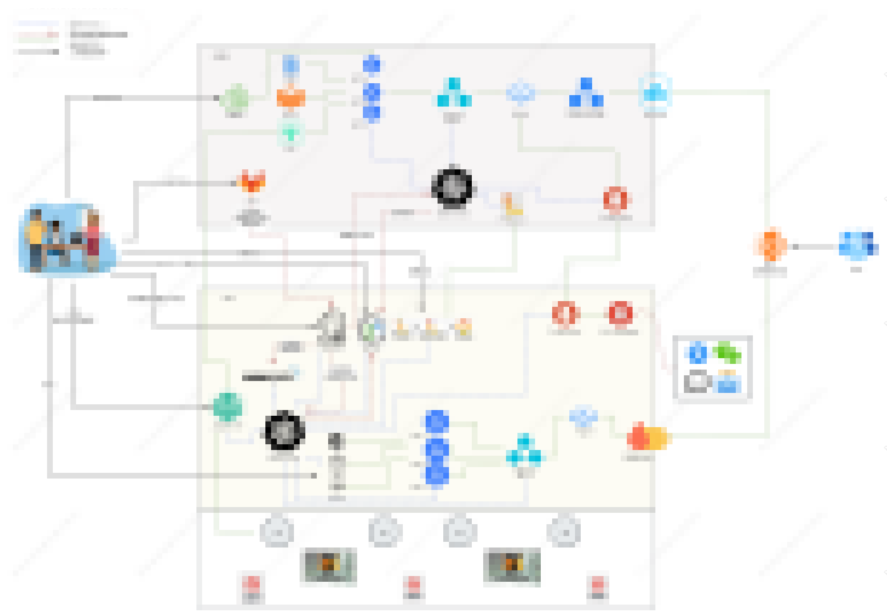

分享我在多个领域的知识和经验。我的专业涉及虚拟化平台、Ceph 存储、操作系统、以及Python编程、容器技术、Kubernetes和Prometheus监控工具等。虽然我在这个圈子里摸爬滚打多年，但我的博客内容并不局限于此。这里，你会看到我对各种话题的看法和思考，既有技术分析，也有生活感悟。欢迎来到我的博客，希望你能在这里找到启发和共鸣。

 

## 个人能力
- 十年运维经验
- 自动化工具数百个
- 数据中心维护数据 __零丢失__
- 企业内部 IaaS - Saas - PaaS 全覆盖
- DevOps 践行者

## 自动化流程设计
__内部流程，仅做展示使用，不暴露细节__
